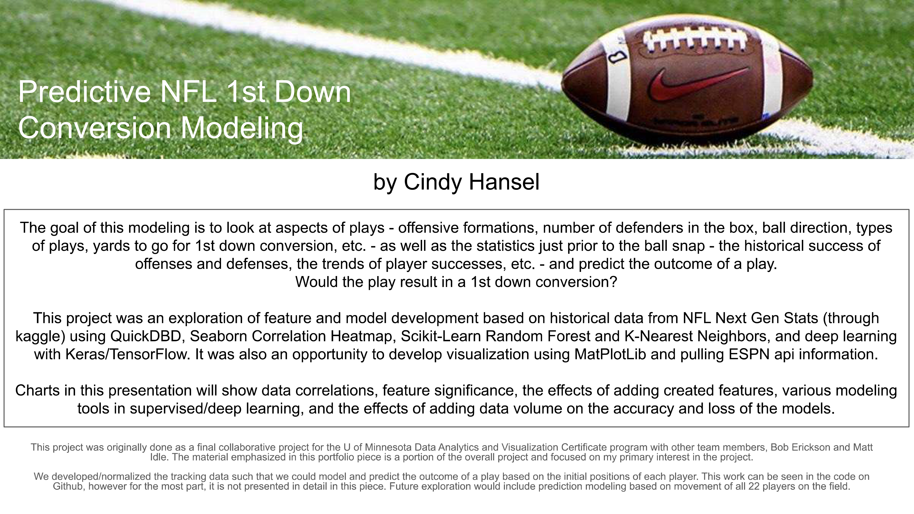

[The Data](#The-Data)

- [QuickDBD](#QuickDBD)

[Features](#Features)

[Newly Created Features](#Newly-Created-Features)

[Cumulative Averages - described](#Cumulative-Averages---described)

[Cumulative Averages - example](#Cumulative-Averages---example)

[MatPlotLib Visualization - the field and positions](#MatPlotLib-Visualization---the-field-and-positions)

[Correlations](#Correlations)

[The Training](#The-Training)

- [Random Forest - Feature Importance](#Random-Forest---Feature-Importance)
 
- [KNN Results](#KNN-Results)
 
- [Deep Model - Keras/TensorFlow](#Deep-Model---Keras/TensorFlow)
 
[Increasing the Volume of Data Over 9 Weeks](#Increasing-the-Volume-of-Data-Over-9-Weeks)

- [Comparing 3rd Downs Only to All Downs](#Comparing-3rd-Downs-Only-to-All-Downs)

[About Tracking Data](#About-Tracking-Data)

- [Comparing KNN Models With/Without Tracking](#Comparing-KNN-Models-With/Without-Tracking)
 
[Future Exploration](#Future-Exploration)

> # The Data

[https://www.kaggle.com/competitions/nfl-big-data-bowl-2024/data](https://www.kaggle.com/competitions/nfl-big-data-bowl-2024/data)  
 Historical data for the first 9 weeks of NFL 2023 season included the following data sets: 
		games.csv, plays.csv, players.csv, tracking.csv, and tackles.csv

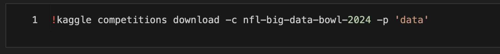

[https://site.api.espn.com/apis/site/v2/sports/football/nfl/teams](https://site.api.espn.com/apis/site/v2/sports/football/nfl/teams) 
	Used for visualization

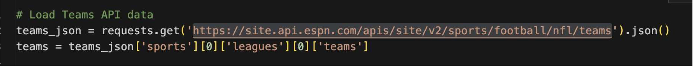

> # QuickDBD

This ID was needed to identify individual plays across the entire database:

- **play_uuid** - a unique Play ID built from gamesID and playsID

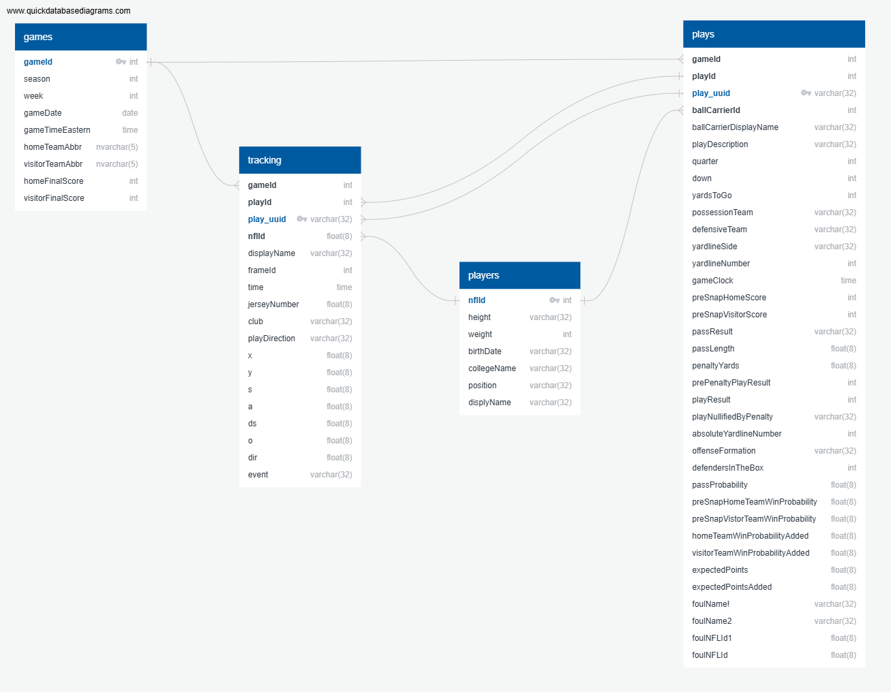

> # Features

## Features used from source

- **gameId:** Game identifier, unique (numeric)
- **playId:** Play identifier, not unique across games (numeric)
- **ballCarrierId:** The nflId of the ball carrier (receiver of the handoff, receiver of pass or the QB scrambling) on the play (numeric)
- **playDescription:** Description of play (text)
- **quarter:** Game quarter (numeric)
- **down:** Down (numeric)
- **yardsToGo:** Distance needed for a first down (numeric)
- **possessionTeam:** Team abbr of team on offense with possession of ball (text)
- **defensiveTeam:** Team abbr of team on defense (text)
- **gameClock:** Time on clock of play (MM:SS)
- **preSnapHomeScore:** Home score prior to the play (numeric)
- **preSnapVisitorScore:** Visiting team score prior to the play (numeric)
- **playResult:** Net yards gained by the offense, including penalty yardage (numeric)
- **absoluteYardlineNumber:** Distance from end zone for possession team (numeric)
- **offenseFormation:** Formation used by possession team (text)
- **defendersInTheBox:** Number of defenders in close proximity to line-of-scrimmage (numeric)
- **preSnapHomeTeamWinProbability:** The win probability of the home team before the play (numeric)
- **preSnapVisitorTeamWinProbability:** The win probability of the visiting team before the play (numeric)
- **homeTeamWinProbabilityAdded:** Win probability delta for home team (numeric)
- **visitorTeamWinProbabilityAdded:** Win probability delta for visitor team (numeric)

## Newly Created Features

These features were created from the existing historical play data:

- **converted** - this equals 1 when playResult equals or exceeds yardsToGo, otherwise 0
- **week** - numeric (1-9) week of the season

Deliberate language within the playDescription column indicates:

- **playType** - pass/run
- **ballDirection** - right/left/middle/none

## Cumulative Averages - described

The following generated features represent historical, cumulative successes/failures. 
The concept is to capture trends in the data over time.

**cumulativeOverall_O** - offensive successful conversions; cumulative average prior to the snap 
**cumulativeOverall_D** - defensive successful blocks; cumulative average prior to the snap 

**cumulativePerFormation_O** - offensive successful conversions with each O-formation; cumulative average prior to the snap 
**cumulativePerFormation_D** - defensive successful blocks against each O-formation; cumulative average prior to the snap 

**cumulativePerBoxCt_O** - offensive successful conversions against each D-box count; cumulative average prior to the snap 
**cumulativePerBoxCt_D** - defensive successful blocks with each D-Box count; cumulative average prior to the snap 

**carrierSuccessOverall** - ball carrier successful conversions; cumulative average prior to the snap 
**carrierSuccessPerFormation** - ball carrier successful conversions with each O-formation; cumulative average prior to the snap 
**carrierSuccessPerBoxCt** - ball carrier successful conversions against each D-box count; cumulative average prior to the snap 

## Cumulative Averages - example

The following shows the running success rate - before the ball is snapped - in the first 5 plays of the season, where Buffalo was the possession team facing 5 defenders in the box. Note that the first play of the season will always be 0.

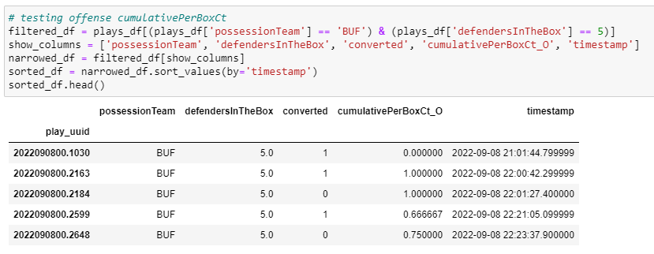

The following probabilities are included in the play data. Since we do not know what calculations are included in these, they introduce possible overlap/redundancy of data. When brought into the model, accuracy was greatly improved. The model was observed both with and without these probabilities.

**preSnapHomeTeamWinProbability**  
**preSnapVisitorTeamWinProbability**

**homeTeamWinProbabilityAdded**      
**visitorTeamWinProbabilityAdded**

> # MatPlotLib Visualization - the field and positions

This is the player and ball positions of a play just prior to the snap in week 3 of the season. Cleveland is lined up in a singleback offensive formation against Pittsburgh's 7 defenders in the box. There are two yards to go for a first down. The play is a run to the left, which only results in a gain of 1 yard and thus a failed first down conversion.

> # Correlations

The following image is a heatmap generated by the Seaborn correlation tool, showing the degree of relationships of potential features. 

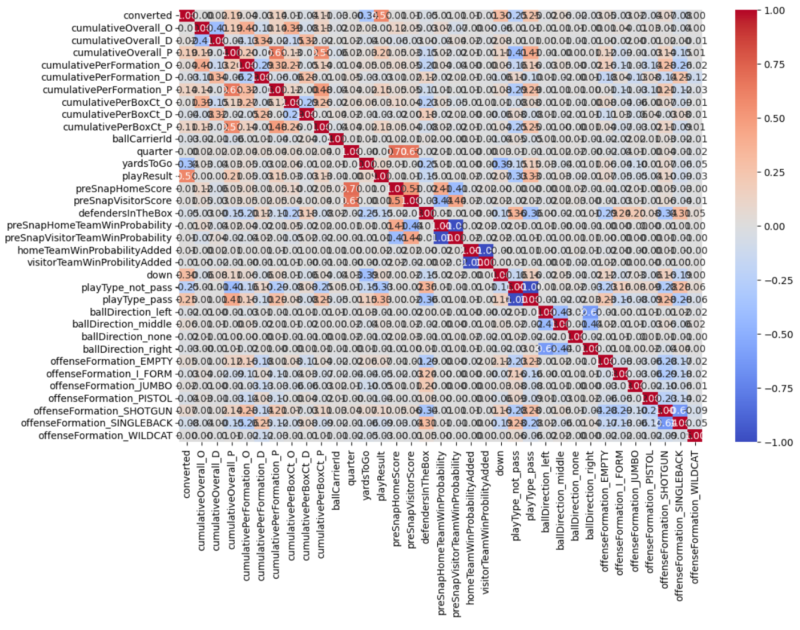

This is a list, in order of absolute strength, of correlations of potential features to the binary result of 'conversion':

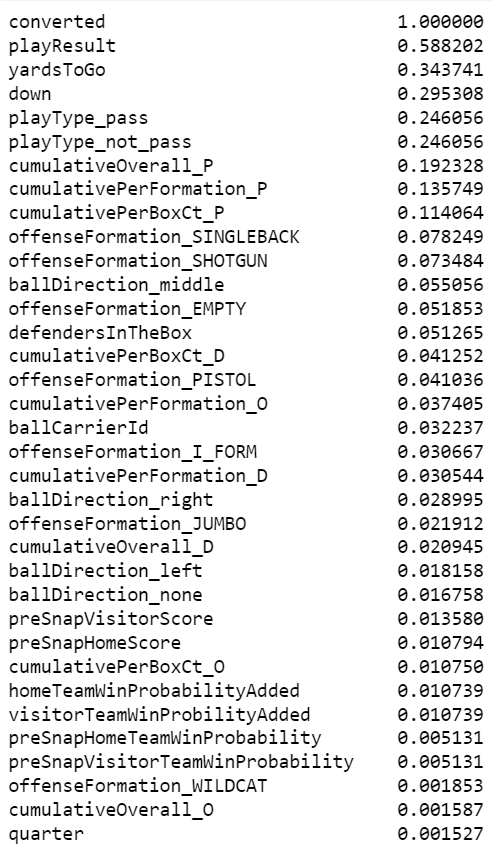

> # The Training

#### Models were created with KNN, Random Forest, and deep modeling with Keras/Tensorflow

> ## Random Forest - Feature Importance

 #### Observing the feature importances from the Random Forest model allowed a practical way to chunk, or group, the data to add into the model  

#### Below, features are added in chunks to observe model accuracy improvement.
The first chunk of features are those that were given and results in an accuracy of 0.69.
The remaining chunks of features are those that have been created and improve the accuracy up to 0.74.

  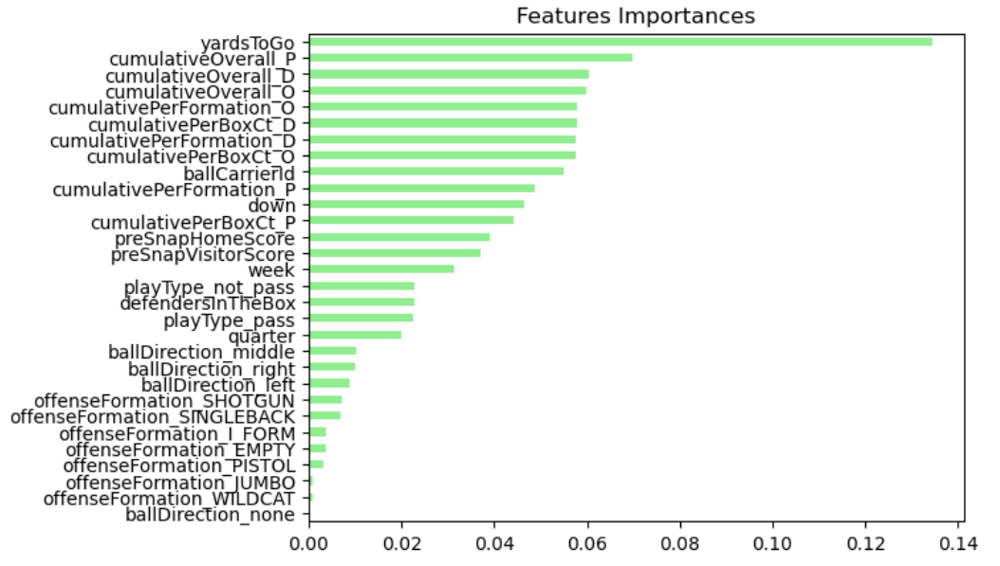
  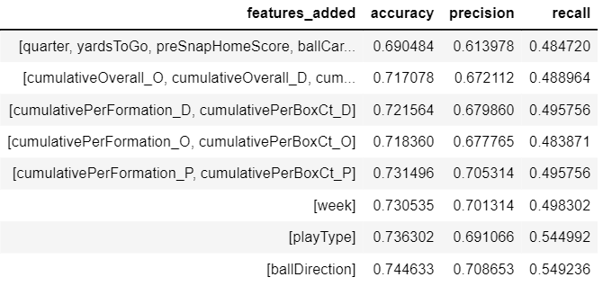

 
 
    
#### Adding the unknown probability features significantly improves model accuracy - up to 0.79.  
However, since we do not know the calculations used to attain this data, we cannot determine the level of redundancy.

  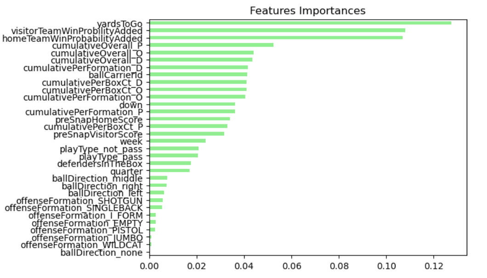
  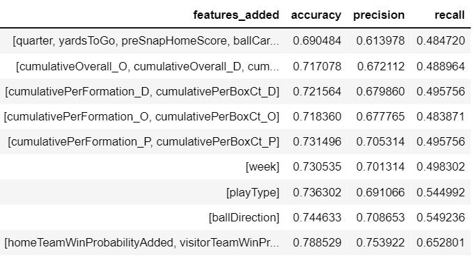

> ## KNN Results

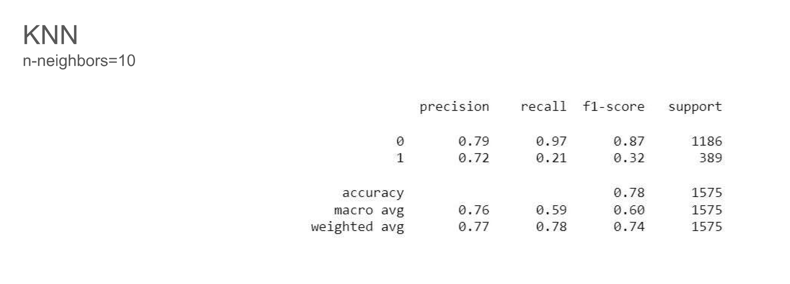

> ## Deep Model - Keras/TensorFlow

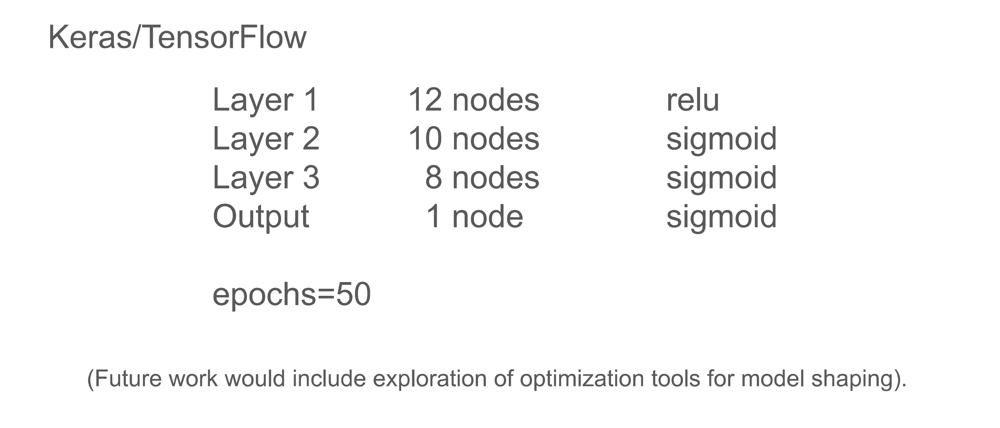

> # Increasing the Volume of Data Over 9 Weeks

Shown below, as data volume increases (shown in the blue bars) the accuracy of the model stabilizes and shows an upward trend. The data loss stabilizes and shows a decreasing trend.

  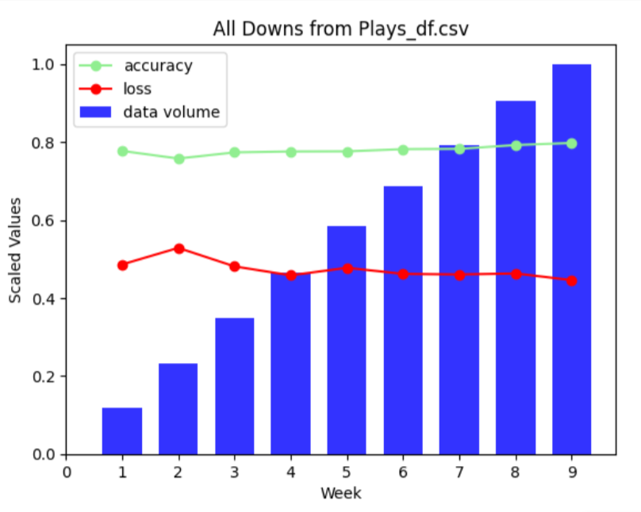
  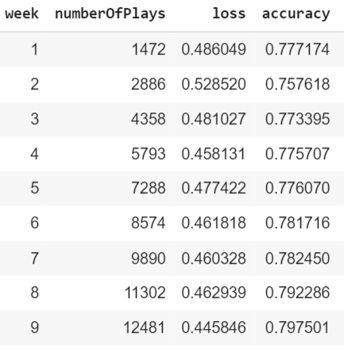

> ## Comparing 3rd Downs Only to All Downs

This comparison shows the effects on model accuracy/loss stability based on the volume of data. The data used for the model on the left is a portion (< ½) of the data used on the right. Stability is significantly improved with greater volume.

  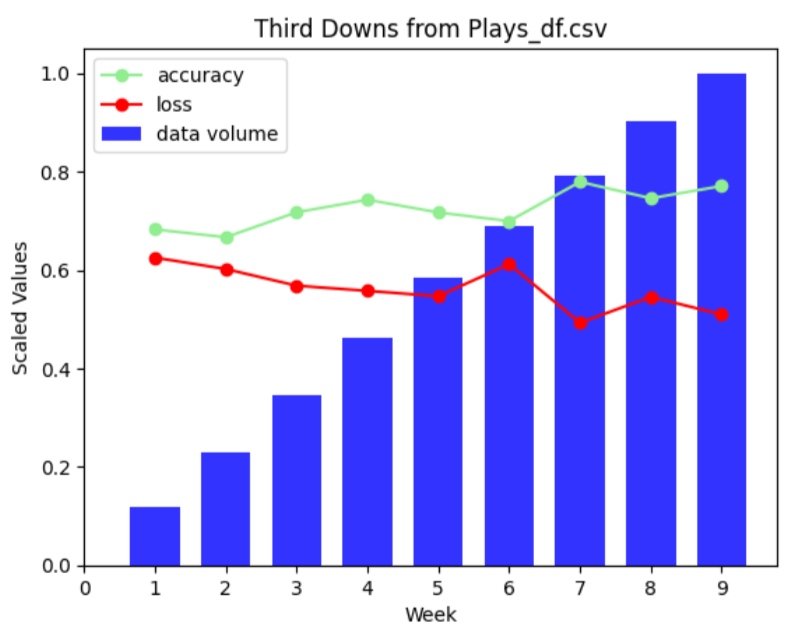
  

> # About Tracking Data

#### The following shows, graphically, how the data is laid out in the original tracking data sets

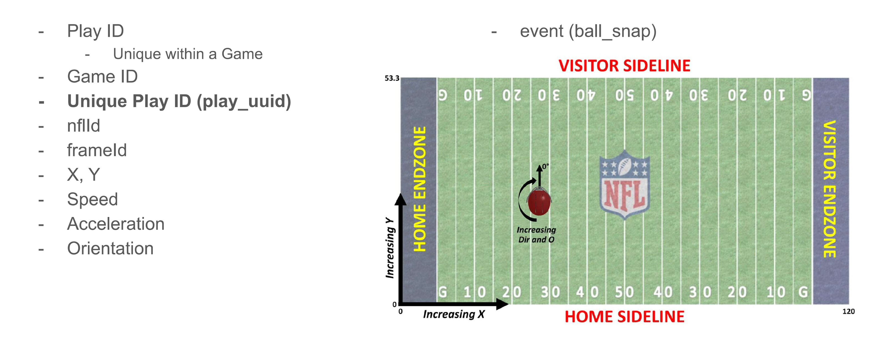

#### And here are examples of how the csv is shaped before and after preprocessing

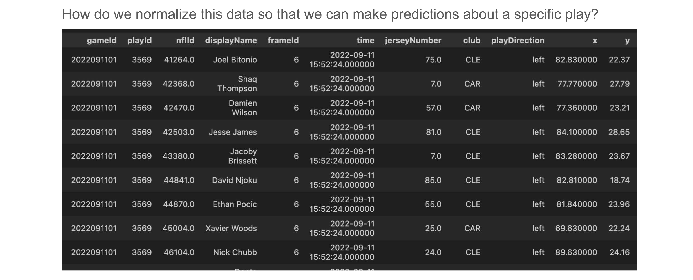

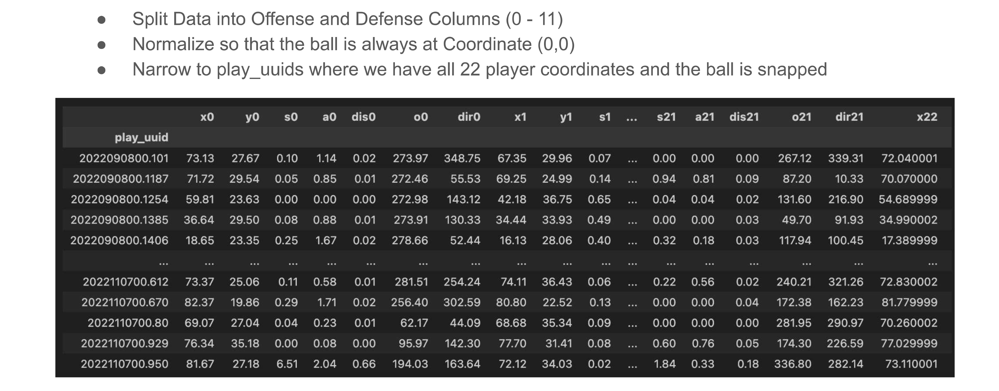

> #### Comparing KNN Models With/Without Tracking

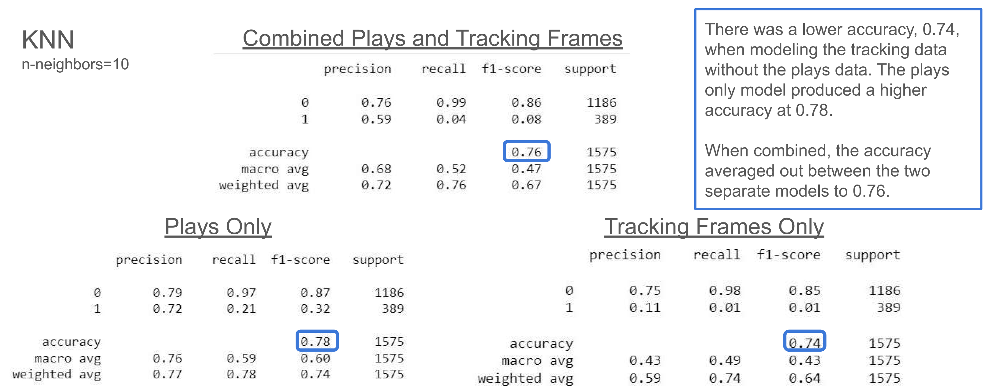

> # Future Exploration

- Weight the cumulative averages to represent recent trending of performance.
- Look at the effect of fouls on the plays and modeling.
- Consider home field advantage.
- Bring in other data/statistics to help establish the predictability of individual players.
- Work with tools that can optimize the deep model.  

- There are many aspects of the tracking data that would be interesting to explore, including:
	- The movement of the offense/defense
	- The distance from the line of scrimmage the rest of the defense is positioned
	- The speed of the runner/receiver as well as the defenders
	- Potential weak spots in the defensive/offensive lines
